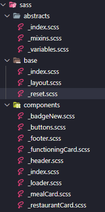
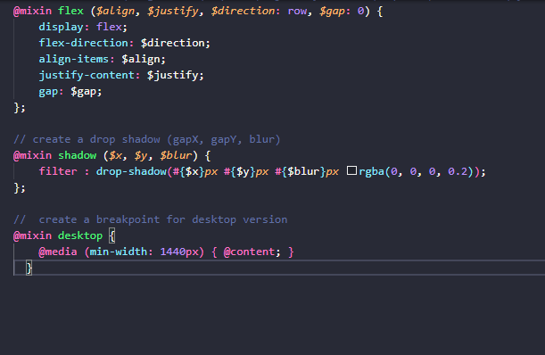
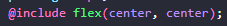
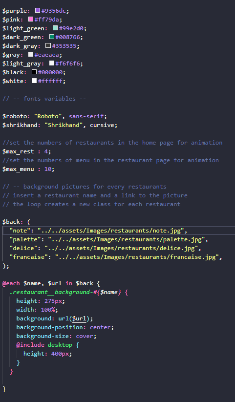

# (Project for OpenClassRoom)

Ohmyfood is a French online ordering meals company. Their concept allows users to compose their own menu in a chosen restaurant and reduce their waiting time in the restaurant, because the menu is prepared in advance. No more wasting time choosing on a card !

# Instructions

## Sass Directory

The project was built using the compiler sass, I've tried to create as much components as i can, so it makes it easier to re-use in differents pages.

here is the file structure and an explanation of it :

Each folder contain an `index.scss` file in which you can find all the `@forward` functions for each files in the folder. The `main.scss` read this `_index.scss` in each folder and create the `style.css`

## _abstracts

contain all the variables and mixins you can re_use in the project.

for example the mixin flex allows you to create a flexbox easily everywhere you need it by simply using this syntax

it's the same for the `drop shadow` and i also include a mixin you can adapt for media queries (in this project only a desktop version was required).

### the variables File

here you can customize all the project, by changing the colors or the fonts.
As the website uses differents animations, i had to find a way to manage them.

>***Just keep in mind that if you want to add a new restaurant in the home page, or a new meal in a restaurant page remember to increase both of those  numbers to keep the animations working ! that's all*** 🙂

For example each restaurant page as a background on the top. Instead of going in each html file and change the link manualy, you can easily change them here. The above function is in charge to create all the differents classes with the appropriate background !! 👍
You can also easily add a new restaurant, all you have to is to add a field with a name and a link to the photo in the `$back` variable and add the new class generated in your restaurant html file !

## _base

here you will find everything concerning the CSS resetting (margin, padding, box sizing formating).

The Layout page contains all the css class to create every single restaurant page, just follow the html structure and add those classes, and you can easily create a new restaurant page in only a few minutes ! 💯

## components

The most important folder, i split all the re-usable code in differents files, so you can easily customize them.
want to add a `drop-shadow` to the restaurant card ?, simply add it the `_restaurantCard` and it will affect all the cards in the website ! isn't it wonderfull ? 🥇
And you know what ? it's the same for all the components ! (buttons, badges, mealCard etc !!!)

You will also find here all the style for my fancy loading screen (hope you will like it !) The header and the footer !

# THANK YOU

Thanks for reading me, hope you will enjoy the project, and if you have any questions, feel free to ask 😃

_thanks to OpenClassroom and see you for the next project !_

